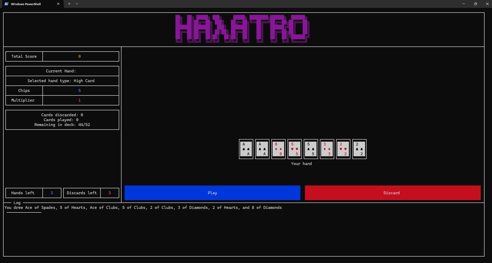

# Halatro (CS141 Coursework 1) | Overall Mark: 88%
> **University of Warwick — Department of Computer Science**  
> Module: [*CS141 — Functional Programming*](https://warwick.ac.uk/fac/sci/dcs/teaching/modules/cs141/)  
> Academic Year: *2024/25*  

## 📋 Description  
This repository contains my coursework submission for the module *CS141 - Functional Programming*. The project implements a Haskell backend for Halatro, a simplified version of the Balatro card game where players aim to score points by playing powerful card hands. The implementation includes:

- Hand type detection (e.g., Royal Flush, Full House)
- Scoring logic for card combinations
- AI players with varying strategies
- Comprehensive test coverage

The project achieved 44/50 marks (88%), with particular strengths in AI optimization and code quality.
The project exceeded the minimum requirements by adding a fully playable UI and file management system, earning high marks for functionality, elegance, and documentation.  



## 📊 Performance Highlights
- AI Score: 704.63 points on average (vs. baseline of 400 and upper bound of 750)

- Code Quality: 9/10 for idiomatic Haskell

- Correctness: Passed 6/8 tests (with 2 failing tests being simple bugs caused by empty lists that were unfixed due to time constraints)

## 🎮 Features  
### Core Implementation
**✅ Hand Analysis**

- Detect all poker hand types (Pair, Flush, etc.) with contains and bestHandType
- Correctly handle edge cases (empty hands, multiple valid types)

**✅ Scoring System**

- Calculate scores using base chips + bonus chips × multiplier
- Identify scoring cards with `whichCardsScore`

### AI Players

- `simpleAI` : Always plays highest-ranked cards (3/3 marks)

- `sensibleAI` : Plays optimal hand without discards (3/3 marks)

- `myAI` : Advanced strategy with discards (9/10 marks)

## 🛠️ Technologies  
- **Languages**: Haskell (GHC 9.4.8)   
- **Tools**: VS Code, Haskell Language Server, Stack.  

## 📂 Repository Structure  
```plaintext 
├── assignment.pdf          # Original coursework brief  
├── feedback.pdf            # Lecturer feedback (95/100)
├── HalatroAI-Approach.pdf  # Description of the AI implementation  
├── code/...                # Source code
├── docs/...                # HTML documentation for the project  
└── README.md               # This file
```

## 🚀 Getting Started

### 🔧 Prerequisites

- Follow the instructions for installing ghcup [on the Haskell.org website](https://www.haskell.org/ghcup/). Answer A
then Y then Y to the three prompts.

- If you are using VSCode, install the haskell extension after installing ghcup and it
will automatically initialise the toolchain once you open a Haskell file in a properlyconfigured project folder. If not using VSCode, please install ghc version 9.4.8;
and stack and cabal recommended versions according to ghcup.

### 🏃‍♂ Running

- Clone the repository

- Navigate to the `code\` directory and:
  - execute the command `stack run` to play Halatro
  - execute the command `stack run ai` to watch the AI play Halatro
  - execute the command `run total n` to run the ai `n` number of times and find the average score 

## ⚠️ Disclaimer

- Student ID and confidential information have been removed.
- Please do not redistribute or submit as your own work.
